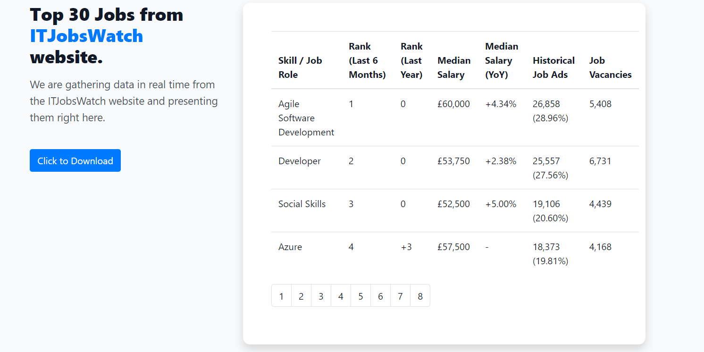

# Final Project - Front End

> Dev branch

## Introduction
The aim of this project is to create a simple service that can scrape useful data from ITJobswatch website and display the current top 30 jobs.
The app is written in Python 3 with Flask microframework. We decided to create one-page website which is divided into four sections:
- Home
- Our Team
- Top 30 Jobs
- Tools

## Pre-Requirements:
- Python 3.x+

Make sure the requirements are installed in your Python environment (or virtual environment). To install the requirements run the command below:
```
python -m pip install -r requirements.txt
```

To run the application:
```
python app.py
```

The above command will run a localhost server on `port 8000` on your machine. To view the app, open any browser and enter `127.0.0.1:8000` or `localhost:8000` as the URL.


## Flask
- Flask is a lightweight WSGI web application framework designed to help developers get started with their web applications quickly and easily with the ability to scale up to complex applications.
- It's categorised as a micro-framework as it does not require particular tools or libraries to function.

## MVC


Parts of Model-view-controller (MVC) were used for this project, which is a software design pattern commonly used for developed user interfaces that divides the related program logic into three interconnected element.

## Structure
- The `static` folder to store stylesheets, javascript files and images.
- The `templates` folder to store the visual representation such as template HTML files.
- `app.py` file which works as the controller with Flask microframework. The app will utilize the Mode-View-Controller design pattern in the back-end to handle requests and distribute responses to the end user. There is also `data_colector.py` file which collects CSV file from a Amazon S3 bucket. 

## Styles and libraries
- Style formatting has been added to the HTML structure using CSS and JS. 
- Jinja2 template library


## Main functionality


Part of `data_collector.py`code which collects CSV file from the S3 bucket.  
It will raise an error if the file is not found
```
def collect_data_url():
    s3_request = requests.get(S3_FILE_URL)

    if s3_request: 
        s3_content = s3_request.content.decode('ISO-8859-1')
        reader = csv.reader(s3_content.splitlines(), delimiter=',')
        context = list(reader)[0:30]
    else:
        context = "The file can't be located in the S3 bucket, or permissions denied."
    return context
```


Part of the script from `app.py` To collect data from the Aamazon S3 bucket. 
```
    data = s3_boto3.collect_data()
    return render_template("home.html", context=context, data=data)  
```

## Our Website
Tools we used for this project, seperated into three groups, each team used different tool set.   


The IT Jobs section, which displays current top 30 IT Jobs from the ITJobsWatch website.   


